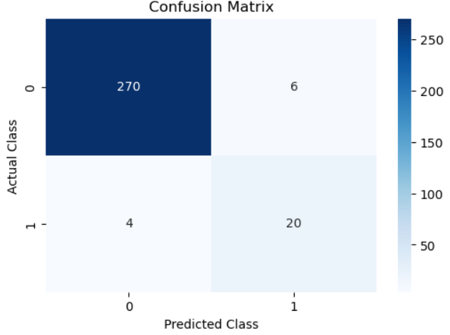
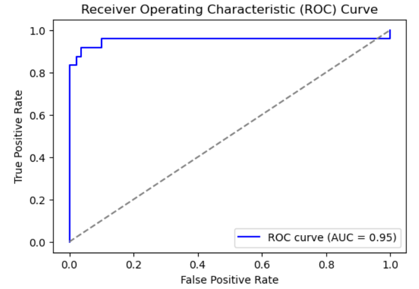

# Imbalanced Data Classification

## Overview

This project focuses on building a machine learning system to handle imbalanced datasets effectively. Imbalanced data occurs when the number of instances in one class significantly outweighs the number of instances in the other class(es), which can lead to biased predictions and poor performance, particularly for the minority class. 

In this project, we use **Logistic Regression** with class weights and the **Synthetic Minority Over-sampling Technique (SMOTE)** to address the imbalance problem. The notebook also provides detailed evaluation using metrics such as the **confusion matrix**, **classification report**, and **ROC curve**.

## Project Structure

```
imbalanced-data-classification/
│
├── imbalanced_data_classification.ipynb  # Jupyter notebook containing the code
└── README.md                             # Project readme file
```

## Features

- **Dataset**: A synthetic imbalanced dataset is generated using `make_classification` from `scikit-learn`, mimicking real-world scenarios such as fraud detection or medical diagnosis.
- **Balanced Class Weights**: Logistic Regression is trained with balanced class weights to account for imbalanced data.
- **SMOTE**: Uses SMOTE to generate synthetic examples of the minority class, balancing the dataset before retraining the model.
- **Evaluation**: The model is evaluated using a confusion matrix, classification report, ROC curve, and AUC score.
- **Visualization**: Confusion matrices and ROC curves are plotted to visually assess the model’s performance.

## Installation

Follow these steps to set up the environment and run the notebook:

1. **Clone the repository**:
   ```bash
   git clone https://github.com/ahmdmohamedd/imbalanced-data-classification.git
   cd imbalanced-data-classification
   ```

2. **Create and activate a Conda environment**:
   ```bash
   conda create --name imbalanced-data python=3.8
   conda activate imbalanced-data
   ```

3. **Install dependencies**:
   Make sure to install the required libraries by running:
   ```bash
   conda install -c conda-forge imbalanced-learn
   conda install scikit-learn matplotlib seaborn
   ```

4. **Run the Jupyter Notebook**:
   Start the Jupyter Notebook:
   ```bash
   jupyter notebook
   ```
   Open `imbalanced_data_classification.ipynb` and run the cells to execute the code.

## Usage

The notebook is divided into the following steps:

1. **Data Generation**: Creates a synthetic imbalanced dataset with the majority class outweighing the minority.
2. **Class Weight Balancing**: Trains a Logistic Regression model with class weights to address class imbalance.
3. **SMOTE for Resampling**: Uses SMOTE to generate synthetic minority class samples and retrains the model on the balanced data.
4. **Evaluation**: Evaluates the model using various metrics (confusion matrix, classification report) and visualizes the performance using plots.

## Visualizations

- **Confusion Matrix**:
   The confusion matrix provides insights into the number of correct and incorrect predictions made by the model for each class.

- **ROC Curve**:
   The ROC curve and AUC score evaluate how well the model distinguishes between classes by comparing the true positive rate (sensitivity) and the false positive rate.

### Example Plots:
Confusion Matrix            |  ROC Curve
:-------------------------:|:-------------------------:
 | 

## Evaluation Metrics

The model is evaluated using the following metrics:

- **Precision**: The accuracy of positive predictions.
- **Recall (Sensitivity)**: The ability of the model to find all the positive instances.
- **F1-Score**: The harmonic mean of precision and recall.
- **AUC-ROC**: The area under the ROC curve, a measure of the model's ability to distinguish between classes.

## Contributing

Contributions are welcome! If you have any improvements, ideas, or bug fixes, feel free to open an issue or submit a pull request.
